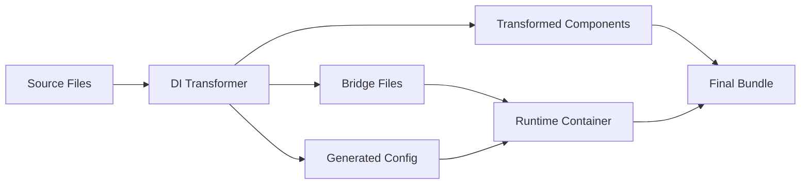

# TDI2 – Dependency Injection for React Functional Components

> A proof-of-concept dependency injection framework that brings Spring Boot-style DI patterns to React applications, with special focus on functional components and build-time optimization.

## 🚀 Overview

TDI2 (TypeScript Dependency Injection 2) is an experimental implementation that explores how dependency injection can be elegantly integrated into React applications without sacrificing the functional programming paradigm or runtime performance. Unlike traditional DI approaches that rely on decorators and reflection metadata, TDI2 uses build-time code transformation to inject dependencies into functional components.

### Key Features

- **🎯 Functional-First DI**: Transform React functional components with marker interfaces
- **⚡ Build-Time Optimization**: Zero runtime overhead through compile-time code generation
- **🔧 Class-Based Support**: Traditional decorator-based DI for service layers
- **🌉 Bridge Architecture**: Clean separation between generated and source code
- **🔄 Hot Reload**: Development-friendly with automatic retransformation
- **📦 TypeScript Native**: Full type safety without `reflect-metadata`

## 🎯 Problem Statement

React's component model, while excellent for UI composition, lacks formalized patterns for dependency management in complex applications. Current approaches have limitations:

- **Context API**: Leads to provider hell and tight coupling for non-UI concerns
- **Direct Imports**: Creates hard dependencies that are difficult to test and swap
- **Manual DI**: Requires boilerplate and doesn't scale systematically

## 🔄 How It Compares

### vs. React Context API

| Aspect          | Context API                     | TDI2                                |
| --------------- | ------------------------------- | ----------------------------------- |
| **Coupling**    | Tight coupling to React tree    | Decoupled from component hierarchy  |
| **Testing**     | Requires provider setup         | Direct service mocking              |
| **Performance** | Re-renders on context changes   | No context-related re-renders       |
| **Scope**       | Limited to React component tree | Application-wide service management |
| **Type Safety** | Manual typing required          | Automatic type inference            |

### vs. Class-Based DI Solutions

TDI2 complements existing class-based DI frameworks rather than replacing them:

#### [LemonDI](https://github.com/OleksandrDemian/lemondi)

- **Similarity**: Decorator-based service registration, compile-time optimization
- **Difference**: TDI2 focuses on functional components, LemonDI on class hierarchies
- **Compatibility**: Could work together - LemonDI for services, TDI2 for components

#### [Better DI Framework](https://dev.to/9zemian5/typescript-deserves-a-better-dependency-injection-framework-29bp)

- **Shared Vision**: Move away from `reflect-metadata` towards build-time solutions
- **Alignment**: Both prioritize TypeScript-native approaches and performance

#### Traditional Solutions (TSyringe, InversifyJS)

- **Runtime Overhead**: Rely on `reflect-metadata` and decorators at runtime
- **Reflection Dependency**: Require additional polyfills and build configuration
- **Performance**: Higher memory usage and slower instantiation

## 🏗️ Architecture

### Functional Component DI

Transform marker interfaces into runtime dependency resolution:

```typescript
// Before transformation (your code)
function UserProfile(props: {
  userId: string;
  services: {
    api: Inject<UserApiInterface>;
    logger?: InjectOptional<LoggerInterface>;
  };
}) {
  // Your component logic using services.api and services.logger
}

// After transformation (generated code)
function UserProfile({ userId }: { userId: string }) {
  const api = useService("USER_API_TOKEN");
  const logger = useOptionalService("LoggerService");
  const services = { api, logger };

  // Your component logic using services.api and services.logger
}
```

### Class-Based Service Layer

Traditional decorator-based DI for business logic:

```typescript
@Service({ token: "USER_API_TOKEN" })
export class UserApiService implements UserApiInterface {
  constructor(
    @Inject("HTTP_CLIENT_TOKEN") private http: HttpClient,
    @Inject() private logger?: LoggerInterface
  ) {}
}
```

### Build-Time Code Generation



## 🚀 Quick Start

### 1. Install Dependencies

```bash
npm install
```

### 2. Run DI Transformation

```bash
npm run di:transform
```

### 3. Start Development

```bash
npm run dev
```

## 📁 Project Structure

```
src/
├── di/                          # DI Framework Core
│   ├── container.ts            # Runtime dependency container
│   ├── context.tsx             # React hooks and providers
│   ├── decorators.ts           # @Service, @Inject decorators
│   ├── markers.ts              # Inject<T>, InjectOptional<T>
│   └── types.ts               # Core type definitions
├── services/                   # Business Services
│   ├── ExampleApiService.ts    # Example service with DI
│   └── ConsoleLoggerService.ts # Logger implementation
├── components/                 # React Components
│   └── NewFunctionalComponent.tsx  # Functional DI examples
├── .tdi2/                     # Bridge Files (auto-generated)
│   ├── di-config.ts           # Points to current config
│   └── registry.ts            # Service registry bridge
tools/
├── di-transformer.ts          # Class-based DI transformer
├── build-time-di-transformer.ts  # Functional DI transformer
├── config-manager.ts          # Configuration and hashing
└── vite-plugin-di.ts         # Vite integration
```

## 🔧 Configuration

### Vite Plugin Setup

```typescript
// vite.config.ts
export default defineConfig({
  plugins: [
    diPlugin({
      verbose: true,
      enableFunctionalDI: true,
      generateDebugFiles: true,
      watch: true,
    }),
    react(),
  ],
});
```

### TypeScript Configuration

```json
{
  "compilerOptions": {
    "experimentalDecorators": true,
    "target": "ES2020",
    "strict": true
  }
}
```

## 🎯 Usage Examples

### Functional Component with DI

```typescript
import type { Inject, InjectOptional } from "../di/markers";

const DataDashboard = (props: {
  title: string;
  services: {
    analytics: Inject<AnalyticsInterface>;
    logger?: InjectOptional<LoggerInterface>;
  };
}) => {
  const { title, services } = props;

  useEffect(() => {
    services.analytics.trackView(title);
    services.logger?.log(`Dashboard ${title} mounted`);
  }, [title]);

  return <div>{title} Dashboard</div>;
};
```

### Service Definition

```typescript
@Service({ token: "ANALYTICS_TOKEN" })
export class AnalyticsService implements AnalyticsInterface {
  constructor(@Inject("HTTP_CLIENT_TOKEN") private http: HttpClient) {}

  async trackView(page: string): Promise<void> {
    await this.http.post("/analytics/view", { page });
  }
}
```

### Container Setup

```typescript
// main.tsx
import { DIProvider, CompileTimeDIContainer } from "./di";
import { DI_CONFIG } from "./.tdi2/di-config";

const container = new CompileTimeDIContainer();
container.loadConfiguration(DI_CONFIG);

createRoot(root).render(
  <DIProvider container={container}>
    <App />
  </DIProvider>
);
```

## 🧪 Testing

### Mocking Services

```typescript
const mockAnalytics: AnalyticsInterface = {
  trackView: jest.fn(),
};

const testContainer = new CompileTimeDIContainer();
testContainer.register("ANALYTICS_TOKEN", () => mockAnalytics);

render(
  <DIProvider container={testContainer}>
    <DataDashboard title="Test" />
  </DIProvider>
);
```

## 🔮 Future Roadmap

### Phase 1: Foundation ✅

- [x] Build-time DI transformation
- [x] Functional component marker interfaces
- [x] Class-based service registration
- [x] Bridge file architecture

### Phase 2: Enhancement 🚧

- [ ] Environment-based profiles (`@Profile`)
- [ ] Testing (`@Mock`)
- [ ] Lifecycle hooks (`onInit`, `onDestroy`)

### Phase 3: Integration 🔮

- [ ] OpenTelemetry integration for better debugging

### Phase 4: Ecosystem 🌟

- [ ] ESLint plugin for DI rules
- [ ] Integration with existing DI frameworks
- [ ] Production case studies

## 🤝 Compatibility with Existing Solutions

TDI2 is designed to work alongside existing DI frameworks:

```typescript
// Service layer using LemonDI or traditional DI
@Injectable()
class UserService {
  constructor(@Inject() private repo: UserRepository) {}
}

// Component layer using TDI2
function UserCard(props: {
  userId: string;
  services: { userService: Inject<UserService> };
}) {
  // Functional component with injected services
}
```

## ⚠️ Current Limitations

- **Experimental**: Not ready for production use
- **Build Tool Dependency**: Requires Vite plugin for transformation
- **IDE Support**: Limited IntelliSense for transformed code
- **Debugging**: Generated code can be harder to debug

## 🏆 Benefits Over Context API

1. **Performance**: No unnecessary re-renders from context changes
2. **Testability**: Direct service mocking without provider setup
3. **Scalability**: Centralized service management across the application
4. **Type Safety**: Compile-time verification of dependencies
5. **Separation of Concerns**: Clear boundary between UI and business logic

## 📚 Inspiration & References

- **Spring Framework**: Decorator-based DI patterns
- **Angular DI**: Hierarchical injection and service organization
- **LemonDI**: Modern TypeScript DI without runtime overhead
- **TSyringe/InversifyJS**: Pioneering TypeScript DI implementations

## 🚀 Getting Started

1. **Clone the repository**
2. **Install dependencies**: `npm install`
3. **Run transformation**: `npm run di:transform`
4. **Start development**: `npm run dev`
5. **Explore examples** in `src/components/`

## 🤝 Contributing

This is an experimental proof-of-concept. Contributions, feedback, and discussions about the approach are welcome!

### Development Commands

```bash
npm run di:transform        # Run DI transformation
npm run di:watch           # Watch mode for development
npm run di:debug           # Generate debug files
npm run di:clean           # Clean generated configs
npm run test              # Run tests
```

## 📄 License

MIT License - See LICENSE file for details

---

_TDI2 is an experimental exploration of dependency injection patterns for modern React applications. It represents one possible future direction for managing complex application dependencies while maintaining the elegance of functional programming._
